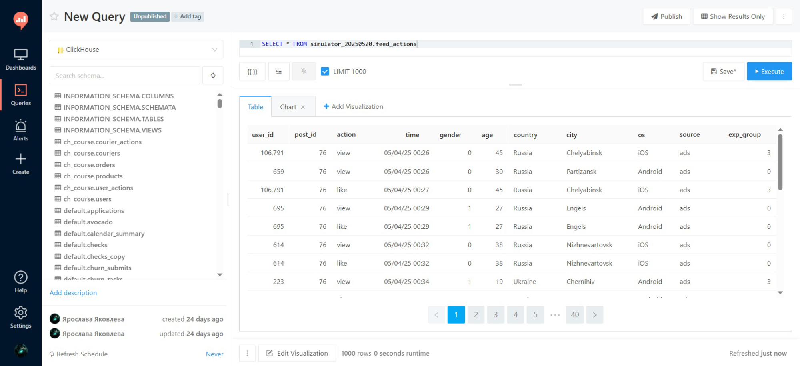

# 📊 Портфолио аналитика данных: Кейсы из "Симулятора"

Привет! 👋

Этот репозиторий — мое портфолио, в котором собраны решения практических задач из курса **"Симулятор аналитика" от Karpov.courses**. Все проекты основаны на данных гипотетического социального приложения, в котором пользователи могут просматривать ленту новостей и обмениваться сообщениями в мессенджере.

Здесь я демонстрирую полный цикл работы аналитика: от исследовательского анализа и построения дашбордов до A/B-тестирования, создания ETL-пайплайнов и систем мониторинга.

---

## 📂 Структура проектов

Ниже представлена структура проектов в этом репозитории. Каждый проект находится в отдельной папке и содержит подробное описание задачи, хода решения и результатов в своем собственном `README.md` файле.

*   [**`ab-testing/`**](#-ab-тестирование) — Комплексный анализ A/B-теста: от проверки системы сплитования (A/A-тест) до применения продвинутых методов (линеаризация).
*   [**`alert-system/`**](#-система-алертов) — Прототип системы мониторинга для детектирования аномалий в ключевых метриках в режиме, близком к реальному времени.
*   [**`data-challenges/`**](#-практические-задачи-eda) — Серия небольших практических задач на исследовательский анализ данных (EDA).
*   [**`engagement-dashboard/`**](#-дашборд-вовлеченности) — Дашборд для анализа пересечения аудиторий ленты новостей и мессенджера.
*   [**`etl-pipeline/`**](#-etl-пайплайн) — Проектирование и реализация ежедневного ETL-пайплайна в Airflow для построения аналитической витрины.
*   [**`forecasting/`**](#-прогнозирование) — Прогнозирование пользовательской активности с использованием модели временных рядов и внешних регрессоров.
*   [**`news-feed-dashboard/`**](#-дашборд-ленты-новостей) — Оперативный дашборд для мониторинга ключевых метрик ленты новостей.
*   [**`product-metrics-dashboard/`**](#-дашборд-продуктовых-метрик) — Аналитический дашборд для исследования причин аномалий в DAU и анализа Retention.
*   [**`reporting-automation/`**](#-автоматизация-отчетности) — Создание автоматизированных ежедневных отчетов в Telegram с помощью Airflow.
*   [**`sample-size-mde/`**](#-расчет-мощности-теста) — Расчет мощности A/B-теста (Power Analysis) с помощью симуляции Монте-Карло.

---

## 🗂️ Исходные данные

Все проекты базируются на двух основных таблицах с данными о действиях пользователей.

#### Лента новостей (`feed_actions`)

#### Мессенджер (`message_actions`)

---

## 🚀 Обзор проектов

### 📊 Дашборд ленты новостей
Оперативный дашборд для ежедневного мониторинга здоровья ленты новостей. Включает метрики верхнего уровня (DAU, WAU, MAU), показатели вовлеченности (лайки, просмотры, CTR) и сегментацию аудитории.
**[➡️ Подробнее...](./news-feed-dashboard/)**

### 📈 Дашборд вовлеченности
Аналитический дашборд для исследования пересечения аудиторий двух ключевых сервисов: ленты и мессенджера. Отвечает на вопросы о размере "ядра" активной аудитории и потенциале для кросс-продвижения.
**[➡️ Подробнее...](./engagement-dashboard/)**

### 💡 Дашборд продуктовых метрик
Глубокий анализ причин аномалий в DAU. Включает когортный анализ Retention рекламных пользователей и исследование сегментов аудитории, столкнувшейся с проблемами.
**[➡️ Подробнее...](./product-metrics-dashboard/)**

### 🧪 A/B-тестирование
Полный цикл анализа эксперимента: от проверки корректности системы сплитования (A/A-тест) до применения различных статистических методов (t-тест, Манн-Уитни, бутстреп, линеаризация) и формулирования бизнес-рекомендаций.
**[➡️ Подробнее...](./ab-testing/)**

### ⚡ Расчет мощности теста
Оценка чувствительности A/B-теста с помощью симуляции Монте-Карло. Проект отвечает на вопрос, сможем ли мы с имеющимся размером выборки обнаружить ожидаемый от нового алгоритма эффект.
**[➡️ Подробнее...](./sample-size-mde/)**

### ⚙️ ETL-пайплайн
Проектирование и реализация ежедневного ETL-процесса в Airflow, который собирает сырые данные, агрегирует их и загружает в структурированную аналитическую витрину в ClickHouse.
**[➡️ Подробнее...](./etl-pipeline/)**

### 📈 Прогнозирование
Построение модели временных рядов (Orbit DLT) для прогнозирования нагрузки на серверы. Включает валидацию, подбор гиперпараметров и использование внешних регрессоров для повышения точности.
**[➡️ Подробнее...](./forecasting/)**

### 🤖 Автоматизация отчетности
Создание двух ежедневных отчетов в Telegram с помощью Airflow: оперативной сводки по ленте новостей и комплексного аналитического отчета по всему приложению.
**[➡️ Подробнее...](./reporting-automation/)**

### 🚨 Система алертов
Прототип системы мониторинга для детектирования аномалий в метриках каждые 15 минут. Использует комбинированный подход (IQR и сравнение с предыдущим днем) и отправляет информативные алерты в Telegram.
**[➡️ Подробнее...](./alert-system/)**

### ✍️ Практические задачи (EDA)
Серия небольших кейсов на исследовательский анализ данных, включая анализ распределений, корреляционный анализ и изучение временных рядов.
**[➡️ Подробнее...](./data-challenges/)**
