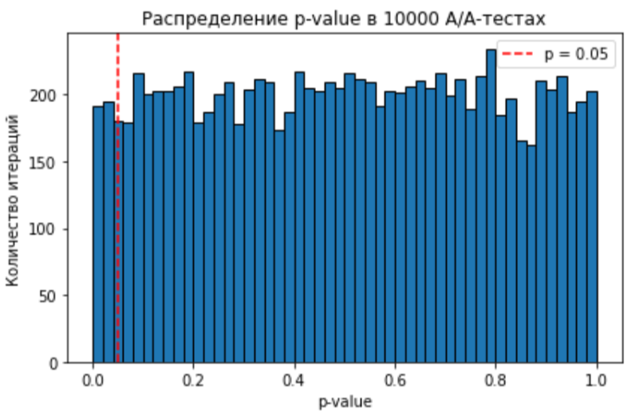
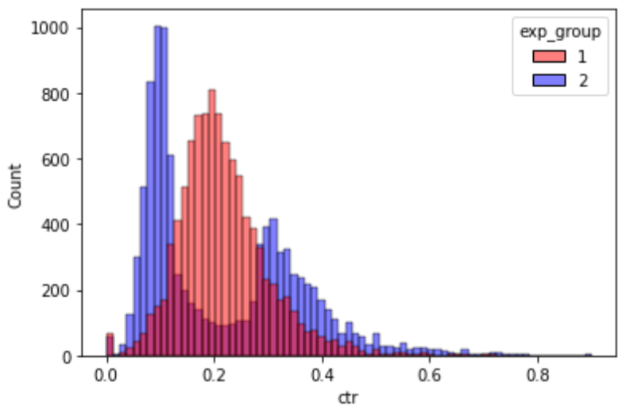

# 📈 A/B-тестирование: от проверки системы сплитования до продвинутых методов

Этот проект представляет собой комплексное исследование, охватывающее весь жизненный цикл A/B-тестирования: от валидации системы сплитования (A/A-тест) до анализа результатов эксперимента с помощью классических и продвинутых методов.

---

### 1. A/A-тест: Проверка корректности системы сплитования

Прежде чем проводить A/B-тесты, критически важно убедиться, что наша система распределения пользователей по группам (сплитования) работает корректно и не вносит систематических ошибок.

#### 🎯 Задача
Проверить, что между двумя контрольными группами (2 и 3) нет статистически значимых различий в ключевой метрике CTR. В идеале, при уровне значимости α=0.05, мы должны получать ложноположительные результаты примерно в 5% случаев.

#### ⚙️ Метод
Была проведена симуляция:
1.  Взяты данные по пользователям из контрольных групп 2 и 3 за период, когда не было экспериментов.
2.  Многократно (10 000 раз) из каждой группы извлекались случайные подвыборки по 500 пользователей.
3.  Для каждой пары подвыборок проводился t-тест на равенство средних CTR.
4.  Фиксировался p-value для каждой итерации.

#### ✨ Результат

Доля случаев, когда p-value оказался меньше 0.05, составила **4.58%**. Это значение очень близко к ожидаемым 5%.

**Вывод:** Система сплитования работает корректно, ей можно доверять. Различия между группами, когда их не должно быть, возникают с предсказуемой случайной частотой.

**[➡️ Посмотреть полный анализ (Jupyter Notebook)](./1_Решение.ipynb)**

---

### 2. A/B-тест: Анализ эксперимента с новым алгоритмом рекомендаций

После валидации системы был проведен эксперимент для проверки гипотезы об улучшении алгоритма рекомендаций.

#### 🎯 Задача
Проанализировать результаты эксперимента, где в тестовой группе 2 был использован новый алгоритм, а группа 1 была контрольной. Основная гипотеза: **новый алгоритм приведет к увеличению CTR.**

#### ⚙️ Методы анализа
Для всестороннего анализа были применены несколько статистических подходов:
*   Визуальный анализ распределений CTR.
*   t-тест для сравнения средних.
*   Тест Манна-Уитни для сравнения распределений.
*   Пуассоновский бутстреп для оценки разницы глобальных CTR.
*   Анализ на основе бакетного преобразования.

#### ✨ Результаты и выводы

*   **t-тест** на сырых данных не показал статистически значимого различия (p-value ≈ 0.68).
*   Однако непараметрический **тест Манна-Уитни** показал стат. значимое различие (p-value ≈ 4.6e-45), причем в пользу **контрольной группы 1**.
*   **Пуассоновский бутстреп** и **анализ на бакетах** подтвердили, что CTR в контрольной группе систематически выше, чем в тестовой.
*   При этом, анализ **90-го перцентиля CTR** внутри бакетов показал интересный эффект: для самой активной аудитории новый алгоритм, наоборот, работает **лучше** и дает более высокий CTR.

**Рекомендация:** **Не раскатывать новый алгоритм на всех пользователей**, так как это приведет к общему падению CTR. Однако, поскольку алгоритм показывает хороший результат на самой вовлеченной аудитории, его стоит рассматривать для **сегментированного внедрения** или доработать, чтобы поднять средние показатели, не теряя эффективности на топ-сегменте.

**[➡️ Посмотреть полный анализ (Jupyter Notebook)](./2_Решение.ipynb)**

---

### 3. Продвинутые методы: Линеаризация для повышения чувствительности

Для метрик-отношений, таких как CTR, стандартные тесты могут терять чувствительность. Чтобы это исправить, был применен метод линеаризации.

#### 🎯 Задача
Проверить, сможет ли метод линеаризации "прокрасить" изменения и показать стат. значимость там, где ее не было видно, и сравнить его результаты с обычным t-тестом.

#### ⚙️ Метод
1.  Для контрольной группы рассчитывался общий CTR.
2.  На его основе для каждого пользователя в обеих группах создавалась новая, линеаризованная метрика: `linearized_likes = likes - CTR_control * views`.
3.  Проводился t-тест на средних значениях этой новой метрики.

#### ✨ Результат
*   **Сравнение групп 1 и 2:** t-тест на линеаризованных лайках показал **статистически значимое падение** метрики в тестовой группе (p-value ≈ 2.9e-09), подтвердив выводы из предыдущего анализа.
*   **Сравнение групп 0 и 3 (A/A-тест):** t-тест на линеаризованных лайках показал **статистически значимое различие**, что является ложноположительным результатом и говорит о том, что при определенных условиях этот метод может быть менее надежен, чем классические подходы.

**Вывод:** Линеаризация является мощным инструментом для повышения чувствительности тестов, но требует осторожного применения и понимания своих ограничений. В данном случае она подтвердила отрицательный эффект от нового алгоритма.

**[➡️ Посмотреть полный анализ (Jupyter Notebook)](./3_Решение.ipynb)**

---
[⬅️ Назад к портфолио проектов](../)
