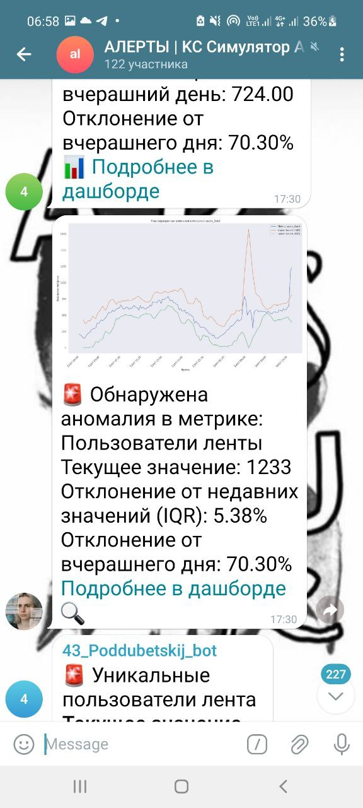
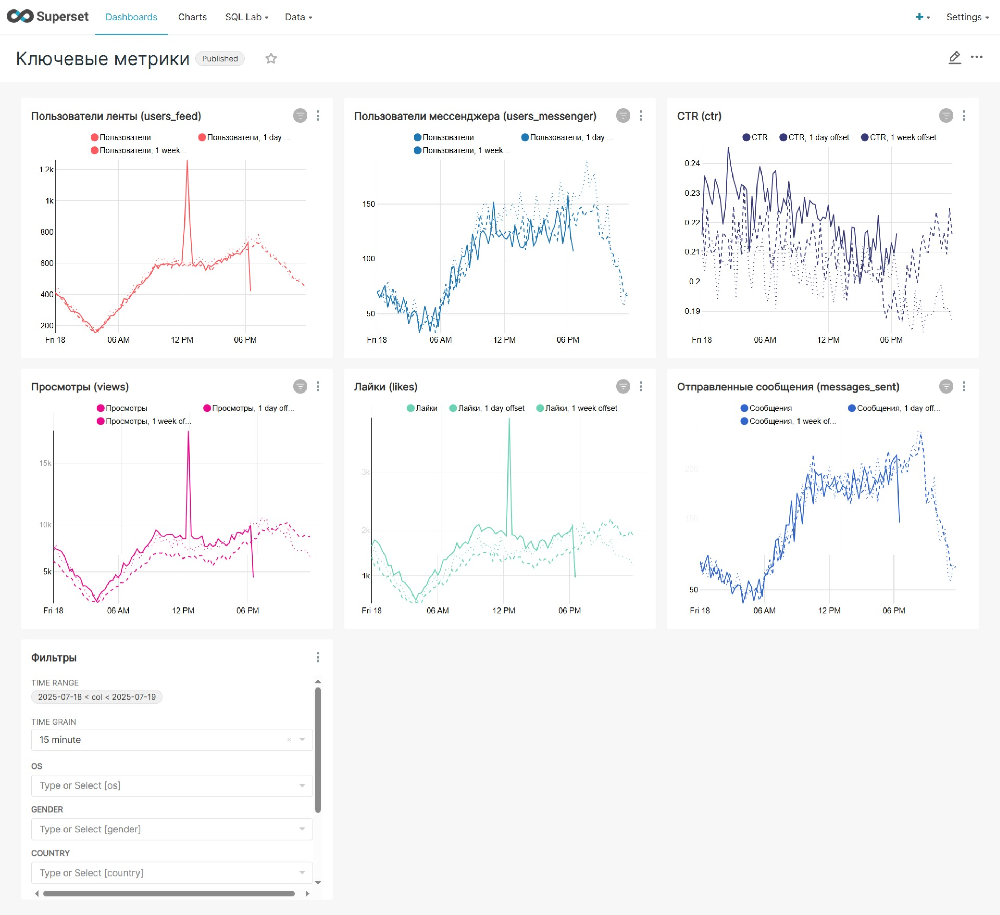

# 🚨 Система алертов для мониторинга аномалий

Этот проект демонстрирует создание автоматизированной системы для оперативного мониторинга ключевых метрик приложения и оповещения об аномалиях в режиме, близком к реальному времени.

---

### 🎯 Бизнес-задача

Разработать систему, которая будет **каждые 15 минут** проверять ключевые продуктовые метрики и в случае обнаружения аномальных отклонений немедленно отправлять алерт в Telegram-чат. Это позволит команде максимально быстро реагировать на инциденты (например, технические сбои или виральный рост).

#### Ключевые требования:
*   **Частота:** Проверка каждые 15 минут.
*   **Метрики:** Активные пользователи (лента/мессенджер), просмотры, лайки, CTR, отправленные сообщения.
*   **Метод:** Необходимо подобрать надежный статистический метод для детектирования аномалий.
*   **Оповещение:** Информативный алерт в Telegram с основной информацией, графиком и ссылкой на дашборд.

---

### ⚙️ Стек и инструменты

*   **Оркестратор:** Apache Airflow
*   **Язык:** Python
*   **Библиотеки:** `pandas`, `telegram`, `matplotlib`, `seaborn`
*   **База данных:** ClickHouse
*   **BI-система:** Superset (для дашборда)

---

### 🧠 Методология детектирования аномалий

Для повышения надежности системы и снижения числа ложных срабатываний был выбран **комбинированный подход**, использующий два статистических метода одновременно:

1.  **Межквартильный размах (IQR):**
    *   **Логика:** Для каждой точки данных на основе `n` предыдущих значений строится "коридор нормальности". Если текущее значение выходит за пределы этого коридора (`Q3 + a*IQR` или `Q1 - a*IQR`), оно считается аномальным.
    *   **Преимущества:** Этот метод устойчив к выбросам в самих данных и хорошо адаптируется к локальным изменениям в поведении метрики.

2.  **Сравнение с предыдущим днем (Day-over-Day):**
    *   **Логика:** Текущее значение метрики за 15-минутный интервал сравнивается со значением в этот же интервал ровно день назад. Если относительное отклонение превышает заданный порог (например, 30%), генерируется алерт.
    *   **Преимущества:** Хорошо улавливает аномалии, связанные с нарушением суточной сезонности.

**Алерт срабатывает, если хотя бы один из этих методов обнаруживает аномалию.**

---

### ✨ Результат

Результатом работы является полностью автоматизированный DAG в Airflow, который каждые 15 минут выполняет проверку и, при необходимости, отправляет в Telegram-канал исчерпывающий алерт.

#### Структура алерта:
*   **Красный эмодзи 🚨** для привлечения внимания.
*   **Название метрики**, в которой обнаружена аномалия.
*   **Текущее значение** метрики.
*   **Величина отклонения** от недавних значений (по методу IQR).
*   **Величина отклонения** от значения днем ранее.
*   **График**, который визуализирует динамику метрики и построенный коридор нормальности (IQR), что позволяет мгновенно оценить масштаб проблемы.
*   **Ссылка на дашборд** в Superset для глубокого анализа и поиска первопричин.

Эта система позволяет команде быть в курсе любых непредвиденных изменений в продукте и принимать решения на основе данных в кратчайшие сроки.

**[➡️ Посмотреть код DAG (Python)](./alerts_yakovleva_ya_1.py)**

---
[⬅️ Назад к портфолио проектов](../)
