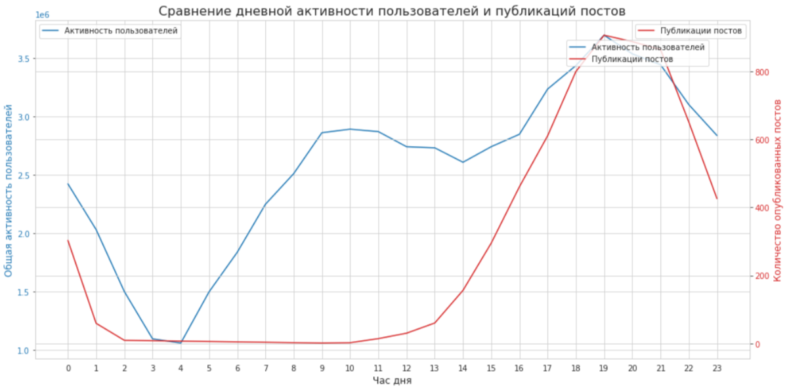

# 🎭 Анализ взаимосвязи активности пользователей и публикаций постов

Этот проект завершает серию исследовательских задач и фокусируется на анализе динамики двух ключевых процессов в приложении: генерации нового контента и общей пользовательской активности.

---

### 🎯 Задача

Проанализировать и сравнить почасовую динамику двух метрик:
1.  **Активность пользователей:** Общее количество действий (`view` + `like`) в час.
2.  **Публикации постов:** Количество новых постов, появившихся в ленте в час (определяется по времени первого просмотра).

Цель — понять, есть ли видимая взаимосвязь между тем, когда публикуется контент, и тем, когда пользователи наиболее активны.

---

### 🛠️ Стек и инструменты

*   **Язык:** Python
*   **Библиотеки:** `pandas`, `matplotlib`, `seaborn`
*   **Источник данных:** `simulator_20250520.feed_actions` (ClickHouse)

---

### 📊 Ход решения и результаты

#### 1. Агрегация данных
Данные были агрегированы по часам для получения двух временных рядов:
*   Общее число действий в час.
*   Число уникальных постов, впервые просмотренных в данный час.

#### 2. Визуализация
Для наглядного сравнения оба временных ряда были наложены на один график. Поскольку масштабы метрик сильно различаются, была использована **вторая ось Y (справа)** для отображения количества опубликованных постов.

**Ключевые наблюдения:**
*   **Активность пользователей (синяя линия):** Демонстрирует четкий **суточный паттерн**. Активность начинает расти утром (примерно с 6:00), достигает пика в дневные и вечерние часы (с 12:00 до 22:00) и резко снижается ночью.
*   **Публикации постов (красная линия):** В отличие от активности пользователей, публикации происходят **равномерно и практически постоянно** в течение всех 24 часов. Нет выраженных пиков или спадов, которые бы коррелировали с пользовательской активностью.

**Вывод:**
На основе визуального анализа можно сделать вывод, что **процесс публикации нового контента и процесс его потребления пользователями не синхронизированы**. Контент появляется в ленте с постоянной интенсивностью, в то время как пользовательская активность сильно зависит от времени суток.

Это наблюдение может стать основой для дальнейших гипотез и экспериментов. Например, можно проверить, приведет ли концентрация публикаций в пиковые часы активности к увеличению общего вовлечения.

**[➡️ Посмотреть полный анализ и код (Jupyter Notebook)](./Pract_4.ipynb)**

---
[⬅️ Назад к списку задач](../)
