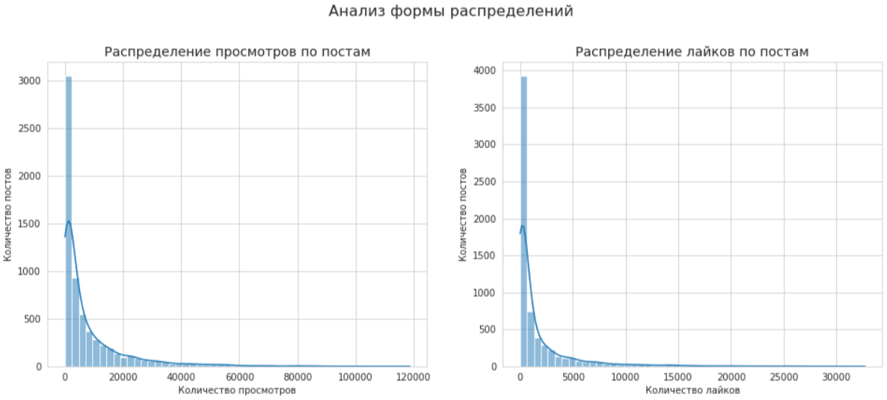
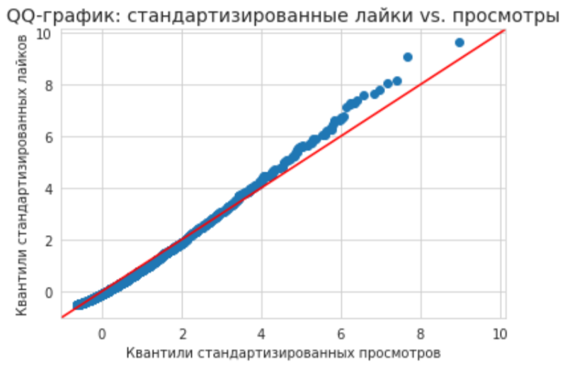

# 📈 Анализ распределений просмотров и лайков

Этот проект посвящен исследовательскому анализу данных (EDA). Основная цель — визуализировать и сравнить распределения двух ключевых метрик вовлеченности: просмотров и лайков по постам.

---

### 🎯 Задача

Нарисовать распределения просмотров и лайков по постам. Определить, какую форму они имеют и есть ли между ними различия.

---

### 🛠️ Стек и инструменты

*   **Язык:** Python
*   **Библиотеки:** `pandas`, `matplotlib`, `seaborn`, `statsmodels`
*   **Источник данных:** `simulator_20250520.feed_actions` (ClickHouse)

---

### 📊 Ход решения и результаты

#### 1. Агрегация данных
Первым шагом данные были агрегированы на уровне каждого поста (`post_id`) для подсчета общего числа просмотров (`views`) и лайков (`likes`).

#### 2. Визуализация распределений
Для визуального анализа были построены гистограммы для обеих метрик.

**Наблюдения:**
*   **Форма распределения:** Обе гистограммы демонстрируют ярко выраженное **распределение с тяжелым правым хвостом** (log-normal-like distribution). Это типично для метрик популярности в социальных сетях: большинство постов получают небольшое или среднее количество просмотров/лайков, и лишь немногие "виральные" посты собирают огромное количество реакций.
*   **Схожесть форм:** Визуально формы распределений для просмотров и лайков очень похожи.

#### 3. Сравнение форм с помощью QQ-графика
Чтобы более строго сравнить формы распределений, был построен QQ-график (quantile-quantile plot). Этот график сопоставляет квантили двух распределений после их стандартизации (z-score). Если точки на графике лежат близко к диагональной линии `y=x`, это означает, что распределения имеют одинаковую форму.

**Вывод:**
Точки на QQ-графике практически идеально ложатся на диагональную линию. Это является сильным визуальным доказательством того, что **распределения просмотров и лайков по постам имеют одинаковую форму**.

**[➡️ Посмотреть полный анализ и код (Jupyter Notebook)](./Pract_1.ipynb)**

---
[⬅️ Назад к списку задач](../)
