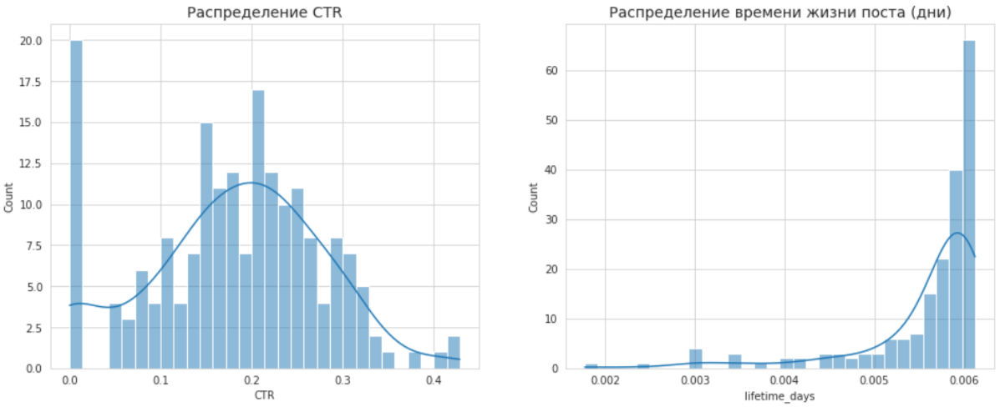
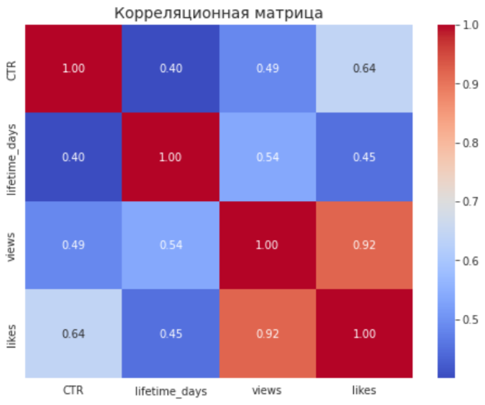
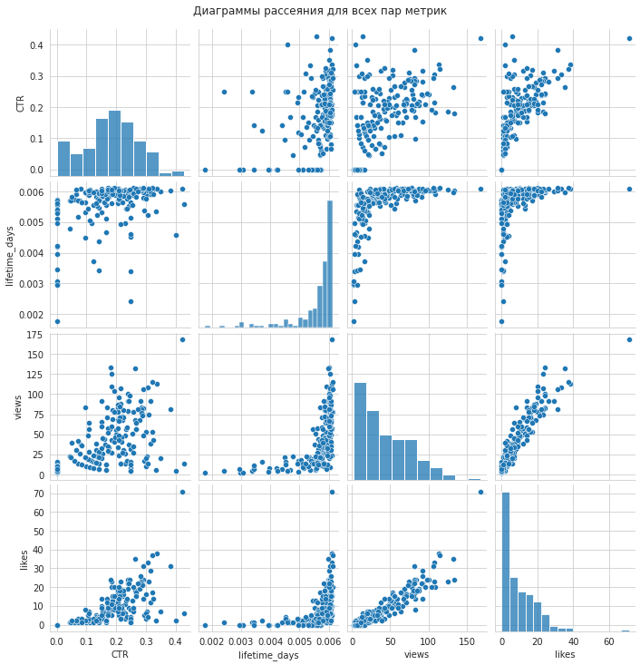

# 🔗 Анализ взаимосвязей продуктовых метрик

Этот проект является углубленным исследовательским анализом данных (EDA), направленным на изучение взаимосвязей между различными метриками вовлеченности контента.

---

### 🎯 Задача

Простые метрики, такие как "сырые" просмотры и лайки, не всегда полностью отражают качество поста. Для более глубокой оценки были предложены две новые метрики:
*   **CTR (Click-Through Rate):** Отношение лайков к просмотрам. Показывает, насколько "кликабельным" и привлекательным является контент.
*   **Время существования поста (lifetime):** Продолжительность времени, в течение которого пост активно смотрят и лайкают. Показывает, насколько долговечен интерес к контенту.

Необходимо было рассчитать эти метрики для каждого поста, а затем:
1.  Нарисовать их распределения.
2.  Построить корреляционную матрицу между ними, а также просмотрами и лайками.
3.  Визуализировать все взаимосвязи в виде диаграмм рассеяния.

---

### 🛠️ Стек и инструменты

*   **Язык:** Python
*   **Библиотеки:** `pandas`, `matplotlib`, `seaborn`
*   **Источник данных:** `simulator_20250520.feed_actions` (ClickHouse)

---

### 📊 Ход решения и результаты

#### 1. Расчет метрик и анализ распределений
Для каждого поста были рассчитаны `CTR` и `lifetime_days`. Гистограммы показали, что обе новые метрики, как и базовые, имеют **распределения с тяжелым правым хвостом**.

#### 2. Корреляционный анализ
Для оценки линейных взаимосвязей между четырьмя метриками (`CTR`, `lifetime_days`, `views`, `likes`) была построена тепловая карта корреляционной матрицы.

**Ключевые наблюдения:**
*   **Сильная положительная корреляция (0.93) между лайками и просмотрами:** Это ожидаемо и логично — чем больше людей видят пост, тем больше лайков он собирает.
*   **Слабая корреляция с CTR:** Метрика CTR практически не коррелирует с другими показателями. Это говорит о том, что CTR является **независимой характеристикой качества** контента. Пост может быть нишевым (мало просмотров), но очень качественным (высокий CTR), и наоборот.
*   **Средняя корреляция с lifetime_days:** Время жизни поста умеренно коррелирует с просмотрами (0.57) и лайками (0.52), что также логично: посты, которые дольше "живут", успевают набрать больше реакций.

#### 3. Визуализация взаимосвязей
Для более детального изучения связей были построены диаграммы рассеяния (pairplot).

**Выводы:**
*   Диаграммы рассеяния подтверждают выводы, сделанные из корреляционной матрицы.
*   Наиболее четкая линейная зависимость видна между `views` и `likes`.
*   Связи с `CTR` выглядят гетероскедастичными (неоднородными), что еще раз подтверждает отсутствие простой линейной зависимости.
*   Анализ показал, что **CTR — это ценная самостоятельная метрика**, которая измеряет внутреннее качество и привлекательность контента, независимо от его охвата.

**[➡️ Посмотреть полный анализ и код (Jupyter Notebook)](./Pract_2.ipynb)**

---
[⬅️ Назад к списку задач](../)
