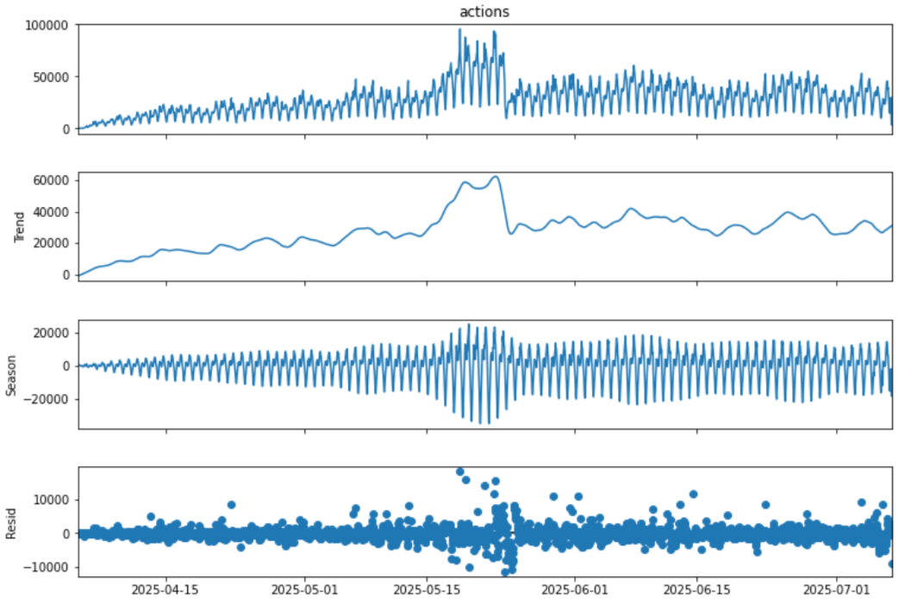

# 🕰️ Анализ динамики и декомпозиция временного ряда

Этот проект посвящен анализу пользовательской активности во времени. Вместо того чтобы рассматривать данные "в статике", мы переходим к их динамике, чтобы понять, какие фундаментальные процессы приводят к изменениям в наших метриках.

---

### 🎯 Задача

Проанализировать дневную динамику двух ключевых метрик:
*   **Активность уникальных пользователей.**
*   **Просмотры уникальных постов.**

Для каждой из метрик необходимо было определить ее характер поведения во времени. Кроме того, для более глубокого анализа был декомпозирован почасовой временной ряд общей активности, чтобы выделить его основные компоненты.

---

### 🛠️ Стек и инструменты

*   **Язык:** Python
*   **Библиотеки:** `pandas`, `matplotlib`, `statsmodels`
*   **Источник данных:** `simulator_20250520.feed_actions` (ClickHouse)

---

### 📊 Ход решения и результаты

#### 1. Анализ дневной динамики
На основе визуального анализа графиков дневной активности были сделаны следующие выводы, которые совпали с верными ответами в задании:

*   **Уникальные пользователи:** Демонстрируют **постоянный рост с небольшими флуктуациями**. Это указывает на то, что продукт находится в стадии роста и стабильно привлекает новую аудиторию.
*   **Просмотры уникальных постов:** Показывают **резкий рост в начале, а затем случайные колебания вокруг одного уровня**. Это может говорить о том, что, хотя аудитория растет, количество "вирального" или нового интересного контента стабилизировалось.

#### 2. Декомпозиция почасового временного ряда
Для более детального изучения динамики был взят временной ряд общей почасовой активности (сумма всех действий). С помощью метода **STL (Seasonal-Trend decomposition using Loess)** он был разложен на три ключевые компоненты:

**Компоненты ряда:**
1.  **Тренд (Trend):** Эта компонента показывает общее долгосрочное направление метрики. На графике виден **устойчивый восходящий тренд**, что подтверждает общий рост продукта.
2.  **Сезонность (Seasonal):** Эта компонента отражает повторяющиеся, предсказуемые паттерны. На графике четко видна **суточная сезонность**: пики активности в дневные и вечерние часы и спады ночью.
3.  **Остатки (Residual):** Это то, что остается после вычитания тренда и сезонности — случайный "шум" или нерегулярные колебания. В данном случае остатки выглядят стационарными (колеблются вокруг нуля), что говорит о хорошем качестве декомпозиции.

**Вывод:**
Декомпозиция позволила количественно подтвердить, что рост пользовательской активности обусловлен сильным **долгосрочным трендом**, на который накладывается предсказуемая **суточная сезонность**.

**[➡️ Посмотреть полный анализ и код (Jupyter Notebook)](./Pract_3.ipynb)**

---
[⬅️ Назад к списку задач](../)
