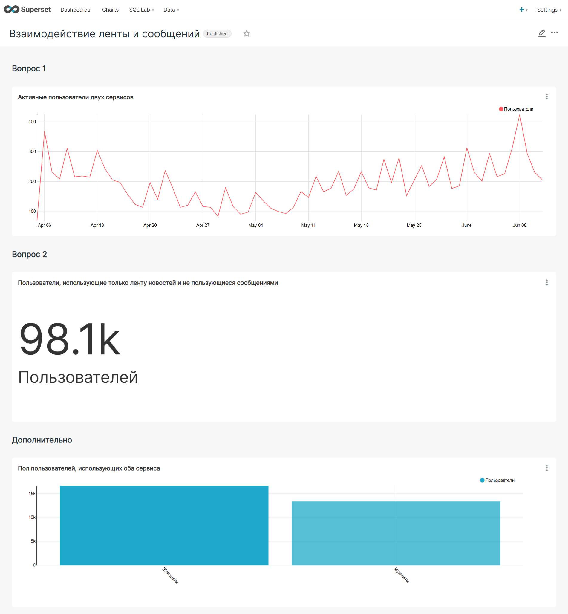

# 📊 Дашборд: Взаимодействие ленты и мессенджера

Этот дашборд анализирует пересечение аудиторий двух ключевых сервисов приложения — Ленты новостей и Мессенджера. Его главная цель — понять, как пользователи распределяются между этими сервисами и каков размер "ядра" аудитории, использующей обе функции.

---

### 🎯 Бизнес-задача

Лента новостей — ключевая часть приложения, но не единственная. Пользователи также могут отправлять сообщения друг другу. Необходимо было оценить, насколько эти аудитории пересекаются, и ответить на следующие вопросы:

1.  **Какая у нашего приложения активная аудитория по дням?** То есть, сколько пользователей в день пользуются *и лентой новостей, и сервисом сообщений*.
2.  **Сколько пользователей использует только ленту новостей** и не пользуется сообщениями?

---

### 🛠️ Стек и инструменты

*   **Источники данных:**
    *   `simulator_20250520.feed_actions` (данные по ленте)
    *   `simulator_20250520.message_actions` (данные по мессенджеру)
*   **Инструмент визуализации:** Superset
*   **Язык запросов:** SQL

---

### 📈 Решение и ключевые метрики

Для ответа на поставленные вопросы был создан дашборд, состоящий из трех ключевых блоков.

#### 1. Активные пользователи двух сервисов (Ответ на Вопрос 1)
*   **Визуализация:** Линейный график.
*   **Метрика:** Количество уникальных пользователей, которые за один день совершили хотя бы одно действие в ленте новостей **И** отправили хотя бы одно сообщение.
*   **Инсайт:** Этот график показывает динамику "ядра" нашей самой вовлеченной аудитории. Он помогает отслеживать, как изменения в продукте влияют на самых активных пользователей.

#### 2. Пользователи, использующие только ленту (Ответ на Вопрос 2)
*   **Визуализация:** Карточка с числом (KPI).
*   **Метрика:** Общее количество уникальных пользователей, которые проявляли активность в ленте, но **ни разу** не отправляли сообщения.
*   **Инсайт:** Это число показывает огромный потенциал для кросс-продвижения. Эти **98.1k** пользователей уже лояльны к нашему приложению, и их можно мотивировать начать пользоваться мессенджером.

#### 3. Дополнительно: Пол пользователей, использующих оба сервиса
*   **Визуализация:** Гистограмма.
*   **Метрика:** Распределение по полу для "ядра" аудитории (пользователей обоих сервисов).
*   **Инсайт:** Этот срез позволяет понять, есть ли гендерные перекосы в самой вовлеченной аудитории, что может быть полезно для маркетинга и разработки нового функционала.

---

### ✨ Результат

Итоговый дашборд четко и наглядно отвечает на поставленные бизнес-вопросы, предоставляя ценную информацию для дальнейшего развития продукта.

*По клику на изображение можно посмотреть его в полном размере.*

---

[⬅️ Назад к портфолио проектов](../)
