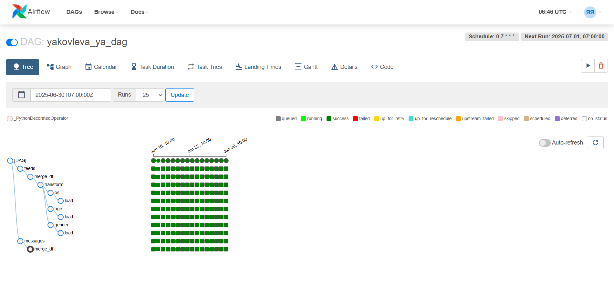
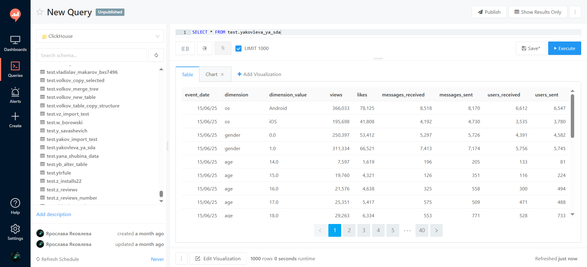

# ⚙️ ETL-пайплайн для построения аналитической витрины

Этот проект демонстрирует создание ежедневного ETL-пайплайна с использованием Apache Airflow. Его задача — собирать сырые данные о действиях пользователей из двух разных источников, агрегировать их и загружать в структурированную аналитическую витрину данных в ClickHouse.

---

### 🎯 Бизнес-задача

Создать автоматизированный процесс, который каждый день будет рассчитывать ключевые метрики пользовательской активности за предыдущий день. Финальная таблица (витрина) должна позволять аналитикам легко и быстро получать агрегированные данные в различных разрезах (`os`, `gender`, `age`) без необходимости каждый раз обращаться к "сырым" таблицам.

---

### 🛠️ Стек и инструменты

*   **Оркестратор:** Apache Airflow
*   **Язык:** Python
*   **Библиотеки:** `pandas`, `pandahouse`
*   **База данных:** ClickHouse

---

### 📈 Архитектура ETL-процесса (DAG в Airflow)

Пайплайн (DAG) спроектирован с учетом эффективности и логического разделения задач.

1.  **Extract & Transform (параллельные таски):**
    *   **`feeds`:** Извлекает данные из таблицы `feed_actions` за вчерашний день и агрегирует их на уровне `user_id`, подсчитывая просмотры (`views`) и лайки (`likes`).
    *   **`messages`:** Извлекает данные из `message_actions` за вчерашний день и считает для каждого пользователя метрики по сообщениям (`messages_sent`, `messages_received`, `users_sent`, `users_received`).

2.  **Join (объединение):**
    *   **`merge_df`:** Объединяет результаты двух предыдущих тасков в единый DataFrame на уровне `user_id`.
    *   **`transform`:** Выполняет очистку и преобразование данных: заполняет пропуски, приводит типы данных к нужному формату.

3.  **Aggregate (финальная агрегация по срезам):**
    *   **`os`, `gender`, `age`:** Три параллельных таска, которые берут объединенные данные и агрегируют их по разным срезам (операционная система, пол, возраст). Это позволяет эффективно распараллелить вычисления.

4.  **Load (загрузка в витрину):**
    *   **`load`:** Финальный таск, который объединяет результаты агрегации по трем срезам в одну таблицу и загружает ее в итоговую витрину `test.yakovleva_ya_sda` в ClickHouse. Таблица спроектирована для инкрементального добавления данных каждый день.

---

### ✨ Результат

Результатом работы пайплайна является готовая аналитическая витрина в ClickHouse. Она имеет "длинную" (unpivoted) структуру, которая идеально подходит для BI-инструментов и аналитических запросов.

#### Структура финальной таблицы:
*   `event_date`: Дата, за которую посчитаны метрики.
*   `dimension`: Название среза (например, 'os', 'gender', 'age').
*   `dimension_value`: Значение среза (например, 'Android', '1.0', '25').
*   `views`: Число просмотров.
*   `likes`: Число лайков.
*   `messages_received`: Число полученных сообщений.
*   `messages_sent`: Число отправленных сообщений.
*   `users_received`: От скольких пользователей получили сообщения.
*   `users_sent`: Скольким пользователям отправили сообщения.

Этот ETL-процесс полностью автоматизирует подготовку данных и обеспечивает аналитиков свежей, надежной и удобной для использования информацией каждый день.

**[➡️ Посмотреть код DAG (Python)](./dag_yakovleva_ya_1.py)**

---
[⬅️ Назад к портфолио проектов](../)
