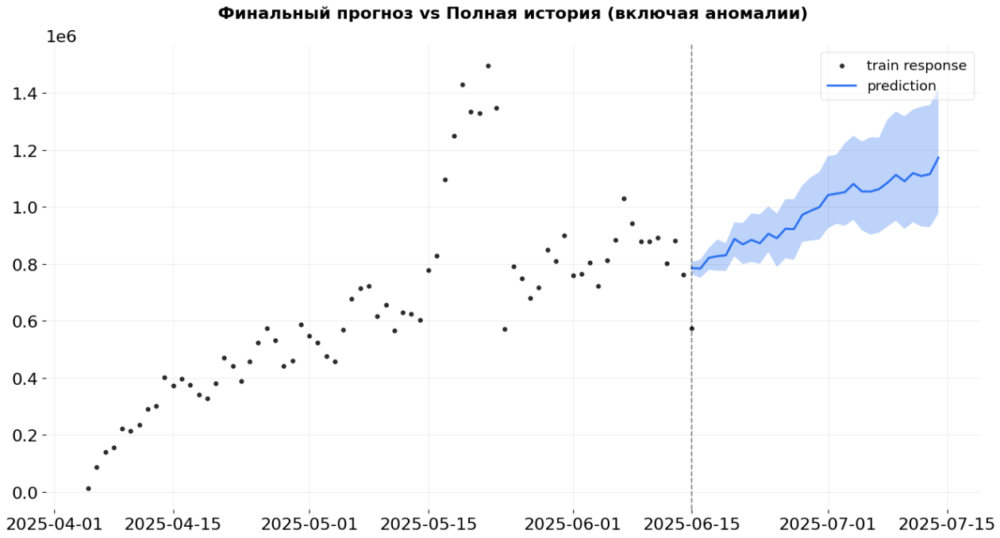

# 📈 Прогнозирование пользовательской активности

Этот проект посвящен решению реальной бизнес-задачи: прогнозированию нагрузки на серверы приложения. С ростом активности пользователей участились жалобы на "подвисания", что требует от инженерной команды проактивного планирования ресурсов.

---

### 🎯 Бизнес-задача

Спрогнозировать, как изменится активность пользователей в течение ближайшего месяца, чтобы помочь DevOps-инженерам подготовить серверную инфраструктуру к ожидаемым нагрузкам.

#### Ключевые аналитические вопросы:
1.  **Выбор метрики:** Какую метрику лучше всего использовать для прогноза? Почему?
2.  **Построение и валидация модели:** Построить модель временного ряда и оценить ее точность. Достаточно ли данных для надежной валидации?
3.  **Выбор лучшей модели:** Сравнить разные подходы (с регрессорами и без, с тюнингом параметров) и выбрать наиболее удачную модель.
4.  **Интерпретация и ограничения:** Объяснить результаты прогноза и указать на важные ограничения, которые нужно учитывать.

---

### ⚙️ Подход и инструменты

*   **Основная метрика:** **Общее суточное количество всех действий пользователей** (сумма `views`, `likes` и `messages`). Эта метрика напрямую коррелирует с нагрузкой на серверы и дает комплексную картину активности в приложении.
*   **Временное разрешение:** **Дневное**. Это "золотая середина", позволяющая отследить недельную сезонность и избежать излишнего шума часовых данных.
*   **Модель:** **DLT (Damped Local Trend)** из библиотеки `orbit`. Это байесовская модель, которая хорошо справляется с трендами, сезонностью и позволяет включать внешние регрессоры.
*   **Регрессоры:** Для улучшения точности в модель были включены внешние факторы:
    *   `ads_actions`: Активность от платного трафика.
    *   `may_holidays`: Майские праздники в России.
    *   `is_flashmob`: Период аномальной активности из-за флэшмоба.

---

### 📊 Результаты и выводы

#### 1. Валидация и сравнение моделей
Были протестированы две основные модели на отложенной выборке (бэктестинг на 14 дней):
*   **Базовая модель (без регрессоров):** Показала среднюю ошибку (MAPE) около **15%**.
*   **Модель с регрессорами:** Значительно улучшила результат, снизив MAPE до **~9%**.

**Вывод:** Добавление внешних факторов (реклама, праздники, аномалии) почти **вдвое повысило точность** прогноза. Модель научилась отделять органический рост от внешних всплесков.

#### 2. Интерпретация финальной модели и прогноза
Финальная модель была обучена на "очищенных" данных (без периода флэшмоба), чтобы выучить "нормальный" паттерн поведения.

*   **Тренд:** Модель уловила общий восходящий тренд пользовательской активности.
*   **Сезонность:** Четко видна недельная сезонность с пиками в будние дни и спадами на выходных.
*   **Влияние регрессоров:** Модель успешно объяснила аномальные всплески активности, связанные с майскими праздниками и рекламными кампаниями.

#### 3. Важные ограничения

*   **Короткая история данных (~2.5 месяца):** Главное ограничение. Модель не знает о годовой сезонности (например, летние спады). Прогноз на горизонте более 1-2 месяцев может быть неточным.
*   **Нестабильность ряда:** Наличие аномалий (флэшмоб, провалы) говорит о том, что метрика подвержена резким непредсказуемым изменениям. Модель прогнозирует "штатный" режим и не сможет предсказать подобные события в будущем.

#### 📈 Рекомендации для бизнеса
1.  **Использовать прогноз как базовый сценарий** для планирования ресурсов в нормальных условиях.
2.  **Внедрить систему мониторинга аномалий** для оперативного реагирования на резкие отклонения от прогноза.
3.  **Продолжать сбор данных** для последующего переобучения модели и учета годовой сезонности.

**[➡️ Посмотреть полный анализ и код (Jupyter Notebook)](./Решение.ipynb)**

---
[⬅️ Назад к портфолио проектов](../)
