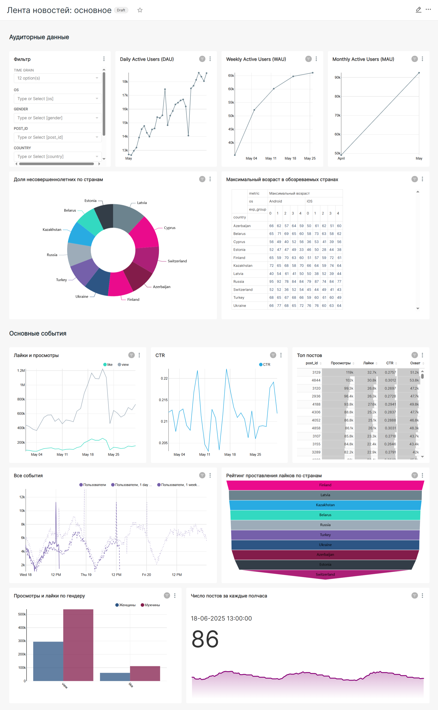

# 📊 Дашборд: Анализ ленты новостей

Этот дашборд — комплексный инструмент для мониторинга и анализа активности пользователей в ленте новостей социального приложения. Он позволяет в реальном времени отслеживать "здоровье" продукта, оценивать вовлеченность аудитории и находить точки роста.

---

### 🎯 Цели дашборда

1.  **Мониторинг ключевых метрик:** Предоставить команде продукта наглядное представление о метриках верхнего уровня (DAU, WAU, MAU) и ключевых событиях (лайки, просмотры).
2.  **Анализ вовлеченности:** Оценить, насколько активно пользователи взаимодействуют с контентом через метрику CTR (Click-Through Rate).
3.  **Сегментация аудитории:** Дать возможность анализировать поведение пользователей в различных разрезах: по географии, демографии, используемым платформам (iOS/Android) и источникам трафика.
4.  **Анализ контента:** Выявлять самые популярные и эффективные посты.

---

### 🛠️ Стек и инструменты

*   **Источник данных:** `simulator_20250520.feed_actions` (ClickHouse)
*   **Инструмент визуализации:** Superset
*   **Язык запросов:** SQL

---

### 📈 Структура и ключевые визуализации

Дашборд логически разделен на два основных блока: **"Аудиторные данные"** и **"Основные события"**.

#### 1. Аудиторные данные
Этот блок отвечает на вопрос "Кто наши пользователи?".

*   **Фильтры:** Позволяют гибко настраивать отображение данных по дате, OS, полу, ID поста и стране.
*   **DAU/WAU/MAU:** Графики Daily, Weekly и Monthly Active Users для оценки размера и динамики активной аудитории.
*   **Географические и демографические срезы:**
    *   **Доля несовершеннолетних по странам:** Кольцевая диаграмма для анализа возрастной структуры аудитории в разных регионах.
    *   **Максимальный возраст в разрезе стран и тестовых групп:** Таблица для выявления аномалий и понимания возрастного состава в разных сегментах.

#### 2. Основные события
Этот блок отвечает на вопрос "Что делают наши пользователи?".

*   **Динамика лайков и просмотров:** Линейный график для отслеживания абсолютного числа ключевых действий.
*   **CTR (Click-Through Rate):** Ключевой показатель вовлеченности, показывающий отношение лайков к просмотрам. Его динамика помогает оценить качество контента и алгоритмов ленты.
*   **Топ постов:** Сортируемая таблица для выявления самых популярных постов по просмотрам, лайкам, CTR и охвату.
*   **Рейтинг стран по активности:** Воронкообразная диаграмма, показывающая, в каких странах пользователи ставят больше всего лайков.
*   **Анализ по полу:** Сравнение количества просмотров и лайков между мужчинами и женщинами.

---

### ✨ Результат

Итоговый дашборд позволяет за несколько минут получить полное представление о том, что происходит в ленте новостей, и принять основанные на данных решения.

*По клику на изображение можно посмотреть его в полном размере.*

---

[⬅️ Назад к портфолио проектов](../)
