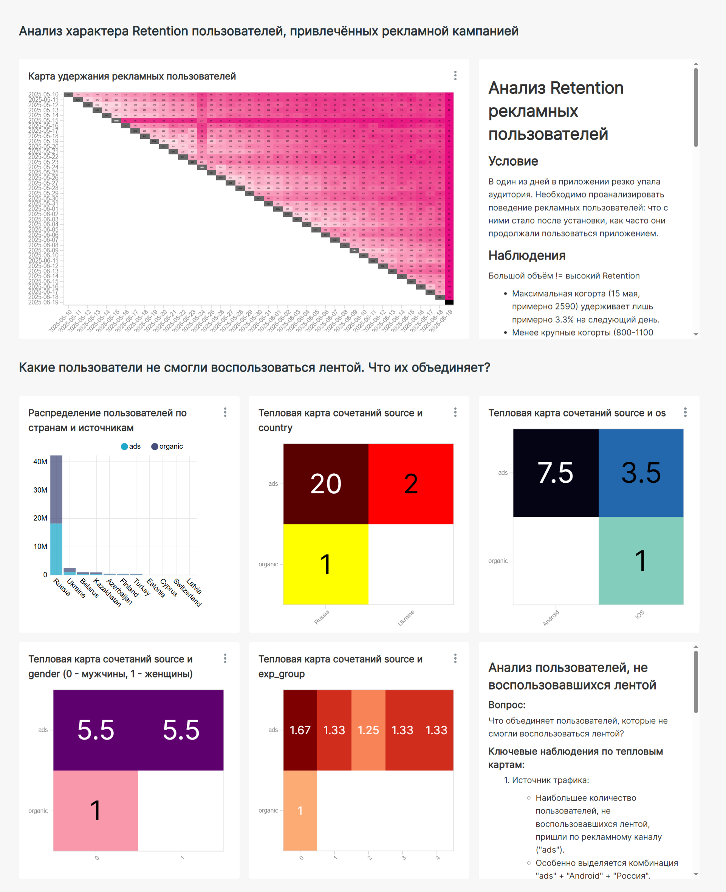
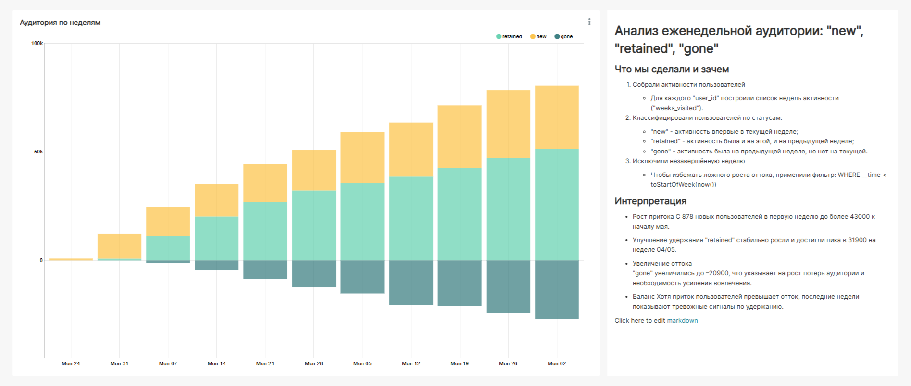

# 📊 Дашборд: Анализ продуктовых метрик и поведения пользователей

Этот дашборд — результат глубокого анализа двух ключевых событий в жизни продукта: проведения крупной рекламной кампании и внезапного падения аудитории. Цель анализа — не просто констатировать факты, а найти их причины и предложить основанные на данных выводы.

---

### 🎯 Бизнес-задачи

На основе графика DAU были поставлены две основные задачи:

1.  **Проанализировать Retention пользователей, привлечённых рекламной кампанией.** Что стало с этими пользователями в дальнейшем, как часто они продолжают пользоваться приложением?
2.  **Выяснить, какие пользователи не смогли воспользоваться лентой** в день падения аудитории. Что их объединяет?

Дополнительно была поставлена задача проанализировать общую динамику аудитории с помощью когортного анализа по неделям (New, Retained, Gone).

---

### 🛠️ Стек и инструменты

*   **Источники данных:** `simulator_20250520.feed_actions`, `simulator_20250520.message_actions`
*   **Инструмент визуализации:** Tableau / Superset (или другой ваш BI-инструмент)
*   **Язык запросов:** SQL (когортный анализ, оконные функции, агрегации)

---

### 📈 Анализ и результаты

Дашборд состоит из 3 логических блоков, каждый из которых отвечает на поставленные вопросы.

 <!-- Замените имя файла на ваше -->

### 1. Анализ Retention рекламных пользователей

Для анализа удержания была построена классическая Retention-матрица (когортный анализ по дням).

#### Ключевые наблюдения:
*   **Большой объём ≠ высокий Retention:** Максимальная когорта (15 мая, ~2590 пользователей) удерживает лишь **3.3%** на следующий день, в то время как когорты меньшего размера (800-1100) показывают в 5-10 раз более высокий Retention в первые дни.
*   **Мгновенный отток:** Во всех рекламных когортах около 60-90% пользователей не возвращаются в приложение уже на второй день. Особенно это заметно в пиковый день 15 мая, где отток к следующему дню составил **96.7%**.
*   **Вывод:** Погоня за максимальным объемом трафика привела к привлечению нецелевой, низкокачественной аудитории. **Стратегия должна быть смещена в сторону баланса между количеством и качеством привлекаемых пользователей.**

---

### 2. Анализ пользователей, не воспользовавшихся лентой

Для ответа на вопрос "Что объединяет отвалившихся пользователей?" были построены тепловые карты и гистограммы, сегментирующие эту аудиторию.

#### Ключевые наблюдения:
*   **Источник:** Подавляющее большинство пользователей пришли по рекламному каналу (`ads`).
*   **Платформа и география:** Наиболее ярко выражена комбинация **"ads" + "Android" + "Россия"**.
*   **Вывод:** Проблема, скорее всего, носит **технический или UX-характер**. Наиболее вероятная причина — баг или проблемы с производительностью в Android-версии приложения, который особенно остро проявился для пользователей из России, пришедших с рекламы. **Необходимо передать эту информацию команде разработки Android для дальнейшего расследования.**

---

### 3. Анализ еженедельной динамики аудитории (New, Retained, Gone)

Для оценки "здоровья" продукта в целом был построен график, разделяющий еженедельную активную аудиторию на три типа: новые, удержанные и ушедшие пользователи.

 <!-- Замените имя файла на ваше -->

#### Ключевые наблюдения:
*   **Рост за счет новых:** Продукт активно растет, в основном за счет постоянного притока новых пользователей (с 878 до ~43000 в неделю).
*   **Стабильное удержание:** Ядро удержанных пользователей (`retained`) также стабильно растет, что является хорошим знаком.
*   **Растущий отток:** Абсолютное число ушедших пользователей (`gone`) увеличивается, что естественно при росте общей базы. Однако, несмотря на то, что приток превышает отток, последние недели показывают тревожные сигналы по удержанию, что требует дальнейшего внимания.

---
[⬅️ Назад к портфолио проектов](../)
