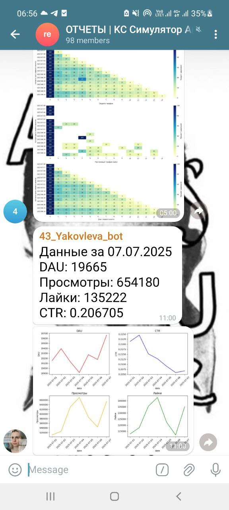
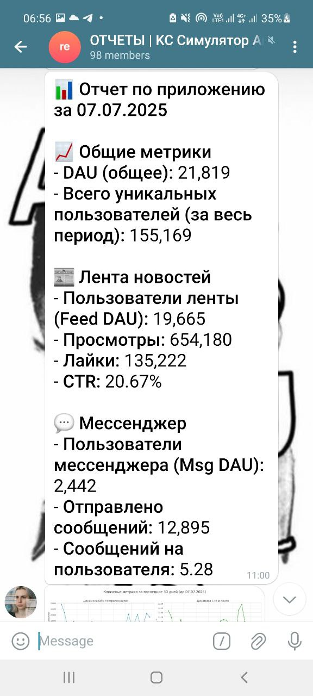
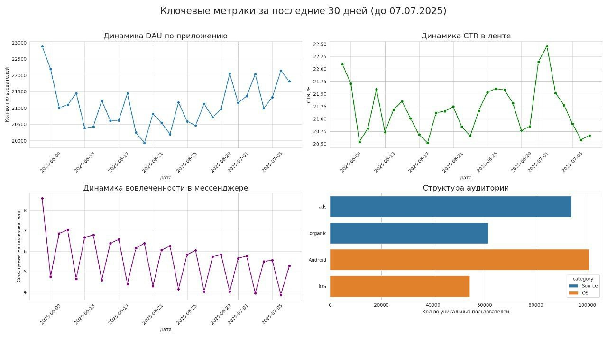

# 🤖 Автоматизация отчетности в Telegram

Этот проект демонстрирует создание двух автоматизированных отчетов, которые ежедневно отправляются в Telegram-канал с помощью Apache Airflow. Цель — обеспечить команду оперативной и аналитической информацией о "здоровье" продукта, сократив время на рутинный сбор данных.

---

### 🛠️ Стек и инструменты

*   **Оркестратор:** Apache Airflow
*   **Язык:** Python
*   **Библиотеки:** `pandas`, `pandahouse`, `telegram`, `matplotlib`, `seaborn`
*   **База данных:** ClickHouse
*   **Канал доставки:** Telegram

---

### 1. Оперативный отчет по ленте новостей

Первый DAG решает задачу ежедневного мониторинга ключевых метрик по основной части приложения — ленте новостей.

#### 🎯 Задача
Автоматически собирать и отправлять в Telegram ежедневную сводку по `DAU`, `просмотрам`, `лайкам` и `CTR` ленты новостей.

#### ✨ Результат
Каждое утро в 11:00 бот присылает в чат сообщение из двух частей:
1.  **Текстовая сводка:** Значения ключевых метрик за предыдущий день.
2.  **Визуализация:** Дашборд из четырех графиков, показывающий динамику этих метрик за последние 7 дней.

Этот отчет позволяет команде быстро оценить текущую ситуацию и заметить аномалии, не тратя время на ручные запросы.

**[➡️ Посмотреть код DAG (Python)](./bot_yakovleva_ya_1.py)**

---

### 2. Комплексный аналитический отчет по всему приложению

Второй DAG решает более сложную задачу — предоставить бизнесу полную картину работы всего приложения как единого целого, анализируя взаимодействие ленты и мессенджера.

#### 🎯 Задача
Продумать и реализовать комплексный отчет, который не просто показывает метрики, а помогает отвечать на вопросы о работе всего приложения в совокупности.

#### ✨ Результат
Этот отчет также приходит ежедневно и состоит из двух частей, но с более глубокой аналитикой:

1.  **Текстовая аналитическая сводка:**
    *   **Общие метрики:** `DAU` всего приложения и общее число уникальных пользователей за все время.
    *   **Разбивка по продуктам:** Ключевые метрики отдельно для ленты новостей (Feed DAU, Views, Likes, CTR) и мессенджера (Msg DAU, Messages Sent). Это позволяет сравнивать популярность и вовлеченность в разных частях приложения.

2.  **Визуальный аналитический дашборд:**
    *   **Динамика DAU и CTR:** Показывает рост и вовлеченность в приложении в целом.
    *   **Динамика вовлеченности в мессенджере:** График "сообщений на пользователя" помогает оценить, насколько активно люди общаются.
    *   **Структура аудитории:** Гистограмма, показывающая распределение всех уникальных пользователей по источнику трафика (`ads`/`organic`) и операционной системе (`iOS`/`Android`).

Этот отчет является мощным аналитическим инструментом, который помогает принимать стратегические решения на основе данных о поведении всей пользовательской базы.

**[➡️ Посмотреть код DAG (Python)](./bot_report_yakovleva_ya_2.py)**

---
[⬅️ Назад к портфолио проектов](../)
